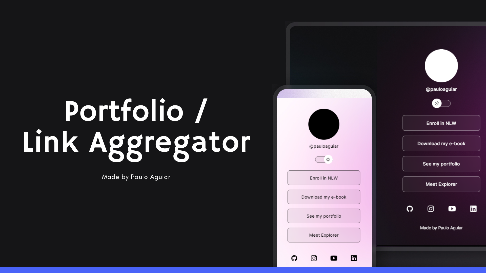

<h1 align="center"> Portfolio Link Aggregator </h1>

  <a href="#-technologies">Technologies</a>&nbsp;&nbsp;&nbsp;|&nbsp;&nbsp;&nbsp;
  <a href="#-project">Project</a>&nbsp;&nbsp;&nbsp;|&nbsp;&nbsp;&nbsp;

  

 

  

## 🚀 Technologies

This project was developed using the following technologies:

- HTML and CSS
- JavaScript
- Git and Github
- Figma

## 💻 Project

The Portfolio Link Aggregator is a link aggregator that can be used as an online business card or a portfolio showcase.

---

Made with ♥ by Paulo Aguiar